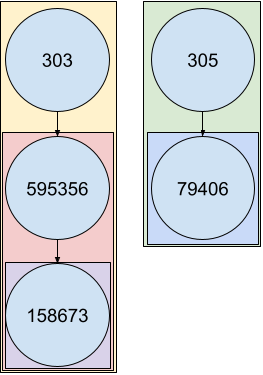

```{r, include = FALSE}
knitr::opts_chunk$set(
  collapse = TRUE,
  comment = "#>",
  fig.width=8, fig.height=8
)
```

```{r setup}
suppressWarnings(suppressPackageStartupMessages(library(orphatools)))
suppressWarnings(suppressPackageStartupMessages(library(kableExtra)))
suppressWarnings(suppressPackageStartupMessages(library(dplyr)))
```


# Orpha code properties
**Classification Levels reminder** :

  * Group of disorders : 36540
  * Disorder : 36547
  * Subtype of disorder : 36554


```{r props}
nom_data = load_nomenclature()
kable(head(nom_data), 'html')

nom_data = translate_properties(nom_data)
kable(head(nom_data), 'html')
```

# Find corresponding disorder / lowest groups of disorders
```{r rolling_up}
subtype_to_disorder(subtypeCode = '158676') # 158676 is a subtype of disorder
subtype_to_disorder(subtypeCode = '303') # 303 is a group of disorder
get_lowest_groups(orphaCode = '158676')
```
It is not recommended to use `subtype_to_disorder` on multiple ORPHAcodes because of efficiency issues.
For a general "rolling up" operation, you will probably need to :

1. convert your data frame to an orpha_df object. The usage of _force_nodes_ argument allows you to make appear any OPRHA code you need (like disorder codes), even if they are not present in data (but the subtypes are).

2. `group_by` and `summarize`/`mutate`.

3. Filter disorder codes.

See section below about "Counting code" for more details.

# Ancestors
## Find ancestors codes
```{r ancestors1}
code = '303'
ancestors_codes = get_ancestors(code, codes_only=TRUE)
print(ancestors_codes)
```

## Build edgelist
```{r ancestors2}
df_ancestors = get_ancestors(code)
kable(df_ancestors, 'html')
```

### Specify classification
**Classifications list :**
```{r class}
all_class = load_classifications()
print(names(all_class))
```


```{r ancestors3}
df_ancestors = get_ancestors(code, class_data = all_class[['ORPHAclassification_156_rare_genetic_diseases_fr']])
kable(df_ancestors, 'html')
df_ancestors = get_ancestors(code, class_data = all_class[['ORPHAclassification_146_rare_cardiac_diseases_fr']])
kable(df_ancestors, 'html')
```


# Descendants
## Find descendants codes
```{r descendants1}
descendants_codes = get_descendants(code, codes_only=TRUE)
print(descendants_codes)
```

## Build edgelist
```{r descendants2}
df_descendants = get_descendants(code)
kable(df_descendants, 'html')
```

### Specify classification
Specifying classification won't change the output but will just save a small amount of time.
```{r descendants3}
df_descendants = get_descendants(code, class_data = all_class[['ORPHAclassification_156_rare_genetic_diseases_fr']])
kable(df_descendants, 'html')
df_descendants = get_descendants(code, class_data = all_class[['ORPHAclassification_146_rare_cardiac_diseases_fr']])
kable(df_descendants, 'html')
```

# Siblings
## Find siblings codes
```{r siblings1}
code = '79361'
siblings_codes = get_siblings(code)
print(siblings_codes)
```

## Build edgelist
```{r siblings2}
df_siblings = get_siblings(code)
kable(df_siblings, 'html')
```

## Specify classification
```{r}
df_siblings = get_siblings(code, class_data = all_class[['ORPHAclassification_156_rare_genetic_diseases_fr']])
kable(df_siblings, 'html')
df_siblings = get_siblings(code, class_data = all_class[['ORPHAclassification_187_rare_skin_diseases_fr']])
kable(df_siblings, 'html')
```

# Visualization
## Plots
```{r visu1}
df_ancestors = get_ancestors(code)
graph_ancestors = igraph::graph_from_data_frame(df_ancestors)

plot(graph_ancestors)
plot(graph_ancestors, layout=igraph::layout_as_tree)
plot(graph_ancestors, layout=layout_tree)
```
Try `interactive_plot` function for a dynamic plot.

## Hierarchical structures
```{r visu2}
df = get_descendants('307711')
graph = igraph::graph_from_data_frame(df)
plot(graph)

df_index = assign_indent_index(df)
df_test = df_index %>% mutate(N = 1:nrow(df_index))
M_shifted = apply_indent(df_test, cols_to_display = c('code', 'N'))
kable(M_shifted, 'html')
```


# Operations on multiple codes
## Common graph
The "common graph" merges the ancestors and/or descendants of each code in the list.
```{r common_graph}
codes_list = c('303', '305', '595356')
common_graph = get_common_graph(codes_list) # both
plot(common_graph, layout=layout_tree)
common_graph = get_common_graph(codes_list, what = 'ancestors')
plot(common_graph, layout=layout_tree)
common_graph = get_common_graph(codes_list, what = 'descendants')
plot(common_graph, layout=layout_tree)
```

## Color graphs
You can emphasize codes on the plotted graph to locate where are the original codes
with `color_graph` function.
`color_graph` enables also the visualization of the classification 
level (Group of disorders, Disorder, Subtype of disorder) on the plotted graph.

```{r}
colored_graph = color_graph(common_graph, 
                            emphasize_nodes = codes_list,
                            display_class_levels = FALSE)
plot(colored_graph, layout=layout_tree)

colored_graph = color_graph(common_graph, 
                            emphasize_nodes = codes_list)
plot(colored_graph, layout=layout_tree)
```


## Lowest Common Ancestors (LCAs)
```{r lcas}
get_LCAs(codes_list)
get_LCAs(codes_list, class_data = all_class[['ORPHAclassification_187_rare_skin_diseases_fr']])
```

## Complete families
This function is useful to find codes that might have been forgotten.

```{r relatives}
new_graph = complete_family(codes_list) %>% 
  color_graph(emphasize_nodes = codes_list, display_class_levels = FALSE)
plot(new_graph, layout=layout_tree)

# Restriction to a specific classification
new_graph = complete_family(codes_list, class_data = all_class[['ORPHAclassification_187_rare_skin_diseases_fr']]) %>% 
  color_graph(emphasize_nodes = codes_list, display_class_levels = FALSE)
plot(new_graph, layout=layout_tree)

# Include parents only
new_graph = complete_family(codes_list, class_data = all_class[['ORPHAclassification_187_rare_skin_diseases_fr']], include_ancestors = FALSE) %>% 
  color_graph(emphasize_nodes = codes_list, display_class_levels = FALSE)
plot(new_graph, layout=layout_tree)
```

# Aggregation operations

For a hierarchical structure like the ORPHA trees, you will probably need to take codes dependencies into account.
Let's consider the simplified structure as the following :


In many cases, your data operations would lead you to something like :

```{r counting1}
df_patients = data.frame(patient_id = c(1,1,2,3,4,5,6),
                         code = c('303', '158673', '595356', '305', '79406', '79406', '595356'))
kable(df_patients, 'html')
```
How many patients can be gathered for each ORPHAcode ?

## Naive aggregation
The basic grouping operation will consider each ORPHAcode as independent.


The naive counting method will then giving you the following results.
```{r}
df_counts = df_patients %>% group_by(code) %>% count() %>% as.data.frame()
kable(df_counts, 'html')
```


## New aggregation
Converting your data frame to an `orpha_df` object will change the _group_by_ behavior on data :



You can observe the direct effect on results of such a method :

```{r counting2}
df_counts = df_patients %>% group_by_code() %>% count() %>% as.data.frame() # Deprecated
df_counts = df_patients %>% orpha_df(orphaCode_col = 'code') %>% group_by(code) %>% count() %>% as.data.frame()
kable(df_counts, 'html')
```
You might also want to count distinct patients instead of all rows present in data :

```{r counting3}
df_counts = df_patients %>% group_by_code() %>% summarize(n = n_distinct(patient_id)) %>% as.data.frame() # Deprecated
df_counts = df_patients %>% orpha_df(orphaCode_col = 'code') %>% group_by(code) %>% summarize(n = n_distinct(patient_id)) %>% as.data.frame()
kable(df_counts, 'html')
```

This also works with `mutate`:

```{r counting-mutate}
df_ext = df_patients %>% orpha_df(orphaCode_col = 'code') %>% group_by(code) %>% mutate.grouped_orpha_df(n_included = n_distinct(patient_id)) %>% as.data.frame()
kable(df_ext, 'html')
```

If your interest is focused on disorders only, keep in mind that `subtype_to_disorder` is unadvised, for computing reasons.
The method presented in this section is considerably more efficient when the sample size increases.
Then you simply can filter disorder codes to get the desired result.

```{r rolling_up_codes}
nom_data = load_nomenclature() %>% translate_properties() %>% select(orphaCode, classLevel)
df_counts = df_patients %>% 
  orpha_df(orphaCode_col = 'code') %>%
  group_by(code) %>%
  summarize(n = n_distinct(patient_id)) %>% 
  left_join(nom_data, by=c('code'='orphaCode')) %>%
  filter(classLevel == 'Disorder') %>%
  as.data.frame()
kable(df_counts, 'html')
```

Finally some desired ORPHAcode might still be missing in the results. 
The main reason is the absence of any of this code in data, even if their subtypes are mentioned.
In these cases, the _force_nodes_ argument is what you want :

```{r}
nom_data = load_nomenclature() %>% translate_properties() %>% select(orphaCode, classLevel)
df_counts = df_patients %>% 
  orpha_df(orphaCode_col = 'code', force_nodes = 231568) %>%
  group_by(code) %>%
  summarize(n = n_distinct(patient_id)) %>% 
  left_join(nom_data, by=c('code'='orphaCode')) %>%
  filter(classLevel == 'Disorder') %>%
  as.data.frame()
kable(df_counts, 'html')
```


