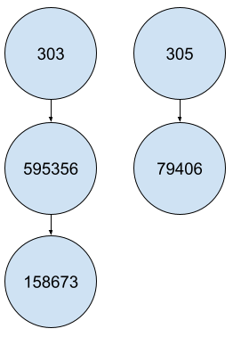
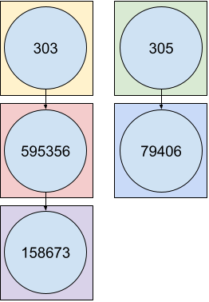

```{r, include=FALSE}
knitr::opts_chunk$set(
  collapse = TRUE,
  comment = "#>",
  fig.width=6, fig.height=4
)
```

```{r, include=FALSE}
suppressWarnings(suppressPackageStartupMessages(library(kableExtra)))
suppressWarnings(suppressPackageStartupMessages(library(dplyr)))
```

`orphatools` is an open-source library consisting in using [Orphanet](https://www.orpha.net/) resources
for efficient computations in R. This vignette provides all needed details for basic and advanced usage in R.

## Getting started

### Installation
No available installation from CRAN yet.
```{r install}

```
---

Then load `orphatools` package to use it in your R code:
```{r load_library}
library(orphatools)
```


### Check options
As Orphanet publishes its data on a regular basis and in various language versions, you should first check if options are corrrectly set: 
```{r options, eval=F}
orphatools_options()
```

In order to update Orphanet data in `orphatools`, you will need to add it via `add_nomenclature_pack` and `add_associated_genes`.

### Load data
You can start handling Orphanet data by using available loading functions:
```{r load}
# Data from the nomenclature pack
df_nomenclature = load_raw_nomenclature()
classif_data = load_classifications()
df_synonyms = load_synonyms()
df_redirections = load_raw_redirections()

# Accessibility: Translate Orphanet concepts using internal dictionary
df_nomenclature = load_nomenclature()
df_redirections = load_redirections()

# Data from the associated genes file
df_associated_genes = load_associated_genes()
df_genes_synonyms = load_genes_synonyms()
```

Alternatively, you can easily access ORPHAcode properties through the following functions:
```{r code_props, results='hold'}
orpha_code = 303
get_label(orpha_code)
get_classification_level(orpha_code)
get_status(orpha_code)
get_type(orpha_code)
```

## Operations on classification
### Analyze genealogy
`orphatools` and `igraph` provide usefool functions to analyze the Orphanet classification system.

#### Parents, children, siblings
```{r direct_relationships}
orpha_code = 303
get_parents(orpha_code)
get_children(orpha_code)
get_siblings(orpha_code)
```


#### Ancestors, descendants
```{r further_relationships_1}
orpha_code = 303
get_ancestors(orpha_code)
get_descendants(orpha_code)
```

These functions also work with a vector of ORPHAcodes as an input. 
In this case, the returned value corresponds to the union of ancestors/descendants.

```{r further_relationships_2}
orpha_codes = c(303, 304)
get_ancestors(orpha_codes)
get_descendants(orpha_codes)
```

#### Lowest common ancestor (LCA)
The Lowest Common Ancestor (LCA) is the closest ancestor that the given ORPHAcodes have in common.
It is possible to have several LCAs, when they belong to independent branches.
```{r lca}
orpha_codes = c('303', '305', '595356')
get_LCAs(orpha_codes)
get_LCAs(orpha_codes, df_classif=classif_data[['ORPHAclassification_187_rare_skin_diseases_fr_2023']])
```


#### Complete family
`complete_family` is equivalent to find ancestors to a limited level (e.g. grand-parents for max_depth=2), and return the whole set of branches induced, including then parents, siblings, cousins, ...

```{r complete_family, results='hold'}
orpha_codes = c('79400', '79401', '79410')
graph_family = complete_family(orpha_codes, max_depth=1)
graph_family = complete_family(orpha_codes, max_depth=2)
```

See the [Visualization] section to plot and color your graph.


#### Alternate output
For all of these functions, it is sometimes more useful to get an equivalent edgelist or graph, 
using the `output` argument:
```{r alternate_output}
df_parents = get_parents(orpha_code, output='edgelist')
graph_descendants = get_descendants(orpha_code, output='graph')
```


### Find upper classification levels
```{r rolling_up, results='hold'}
subtype_to_disorder(orpha_code = '158676') # 158676 is a subtype of disorder
subtype_to_disorder(orpha_code = '303') # 303 is a group of disorder
get_lowest_groups(orpha_code = '158676')
```

It is not recommended to use `subtype_to_disorder` if `orpha_code` is a large vector because of efficiency issues.

If you need to apply the function on a wide set of ORPHAcodes, you will probably need to :

1. convert your data frame to an orpha_df object. The usage of _force_nodes_ argument allows you to make appear any ORPHAcode you need (like disorder codes), even if they are not present in data (but the subtypes are).

2. `group_by` and `summarize`/`mutate`.

3. Filter disorder codes.

See the [Aggregation] section for more details.


### Specify classification
For all the functions described above, it is possible to analyze a specific classification only through the `df_classif` argument.
You might want to be restricted to an edgelist from one of the functions above, or directly take one of the 34 Orphanet classifications,
which are stored in the list returned by `load_classifications`.

Find the corresponding classification through the following:
```{r class}
all_classif = load_classifications()
cat(sprintf('%s\n', names(all_classif)))
```

Here are some examples:
```{r use_spec_class, eval=FALSE}
orpha_code = 303
orpha_codes = c('79400', '79401', '79410')
get_ancestors(orpha_code, df_classif=classif_data[['ORPHAclassification_156_rare_genetic_diseases_fr_2023']])
get_ancestors(orpha_code, df_classif=classif_data[['ORPHAclassification_146_rare_cardiac_diseases_fr_2023']])
get_siblings(orpha_code, df_classif=classif_data[['ORPHAclassification_156_rare_genetic_diseases_fr_2023']])
get_siblings(orpha_code, df_classif=classif_data[['ORPHAclassification_187_rare_skin_diseases_fr_2023']])
complete_family(orpha_codes, df_classif=classif_data[['ORPHAclassification_187_rare_skin_diseases_fr_2023']])
```


## Visualization
Orphanet built a large classification system that sometimes needs a specific display to better understand
how ORPHAcodes are related to each other. 

### Plot
The most straightforward way to visualize it is to plot the graph. 
Use the `layout` argument to sort ORPHAcodes from top to bottom.
```{r basic_plot, results='hold'}
orpha_code = 303
graph = get_ancestors(orpha_code, output='graph')

plot(graph)
plot(graph, layout=igraph::layout_as_tree)
plot(graph, layout=orphatools::layout_tree)
```

For larger graphs, a static plot won't be enough to see the graph details.
Try `interactive_plot` function for a dynamic plot, which allows you to move/zoom and to change nodes position.
```{r interactive_plot, eval=F}
interactive_plot(graph_ancestors)
```

You can emphasize codes on the plotted graph to locate where are some specific ORPHAcodes
with `color_codes`, while `color_classification_level` .

```{r color_plot}
init_codes = c(303, 305)
graph = get_descendants(init_codes, output='graph') %>%
  color_codes(init_codes) %>%
  color_class_levels()
plot(graph)
```

### Hierarchical structures
```{r indent}
orpha_codes = c(303, get_descendants('303'))

df = data.frame(orpha_code=orpha_codes) %>%
  orpha_df(orpha_code_col='orpha_code') %>%
  left_join(load_nomenclature(), by='orpha_code')

df_indent = apply_orpha_indent(df, indented_cols='label', prefix='Label_')
kable(df_indent, 'html')
```


## Aggregation operations
For a hierarchical structure like the ORPHA trees, you will probably need to take codes dependencies into account.
Let's consider the simplified structure as the following :



In many cases, your data operations would lead you to something like :

```{r counting1}
df_patients = data.frame(patient_id = c(1,1,2,3,4,5,6),
                         code = c('303', '158673', '595356', '305', '79406', '79406', '595356'),
                         status = factor(c('ongoing', 'confirmed', 'ongoing', 'ongoing', 'confirmed', 'ongoing', 'ongoing'), levels=c('ongoing', 'confirmed'), ordered=TRUE))
kable(df_patients, 'html')
```
How many patients can be gathered for each ORPHAcode ?

### Naive grouping method
The basic grouping operation will consider each ORPHAcode as independent.



The naive counting method will then giving you the following results.
```{r}
df_counts = df_patients %>% group_by(code) %>% count() %>% as.data.frame()
kable(df_counts, 'html')
```


### Customized grouping method
Converting your data frame to an `orpha_df` object will change the _group_by_ behavior on data :


You can observe the direct effect on results of such a method :

```{r counting2}
df_counts = df_patients %>% orpha_df(orpha_code_col = 'code') %>% group_by(code) %>% count() %>% as.data.frame()
kable(df_counts, 'html')
```
You might also want to count distinct patients instead of all rows present in data :

```{r counting3}
df_counts = df_patients %>% orpha_df(orpha_code_col = 'code') %>% group_by(code) %>% summarize(n = n_distinct(patient_id)) %>% as.data.frame()
kable(df_counts, 'html')
```

This also works with `mutate`:
```{r counting-mutate1}
# Naive
df_patients_extended = df_patients %>% group_by(code) %>% mutate(n_included = n_distinct(patient_id)) %>% as.data.frame()
kable(df_patients_extended, 'html')
```

```{r counting-mutate2}
# Turn on Orphanet mode
df_patients_extended_orpha = df_patients %>% orpha_df(orpha_code_col = 'code') %>% group_by(code) %>% mutate(n_included = n_distinct(patient_id)) %>% as.data.frame()
kable(df_patients_extended_orpha, 'html')
```

If your interest is focused on disorders only, keep in mind that `subtype_to_disorder` is unadvised, for computing reasons.
The method presented in this section is considerably more efficient when the sample size increases.
Then you simply can filter disorder codes to get the desired result.

```{r rolling_up_codes}
df_nomenclature = load_nomenclature() %>% select(orpha_code, level)
df_counts = df_patients %>%
  orpha_df(orpha_code_col = 'code') %>%
  group_by(code) %>%
  summarize(n = n_distinct(patient_id)) %>%
  left_join(df_nomenclature, by=c('code'='orpha_code')) %>%
  filter(level == 'Disorder') %>%
  as.data.frame()
kable(df_counts, 'html')
```

```{r group_other_vars}
df_nomenclature = load_nomenclature() %>% select(orpha_code, level)
df_status = df_patients %>%
  orpha_df(orpha_code_col = 'code') %>%
  group_by(patient_id, code) %>%
  summarize(status = max(status)) %>%
  left_join(df_nomenclature, by=c('code'='orpha_code'))
kable(df_status, 'html')
```

Finally some desired ORPHAcode might still be missing in the results.
The main reason is the absence of any of this ORPHAcode in data, even if their subtypes are mentioned.
In these cases, the _force_nodes_ argument is what you want :

```{r}
df_nomenclature = load_nomenclature() %>% select(orpha_code, level)
df_counts = df_patients %>%
  orpha_df(orpha_code_col = 'code', force_codes = 231568) %>%
  group_by(code) %>%
  summarize(n = n_distinct(patient_id)) %>%
  left_join(df_nomenclature, by=c('code'='orpha_code')) %>%
  filter(level == 'Disorder') %>%
  as.data.frame()
kable(df_counts, 'html')
```


## Update codes

As the Orphanet classification constantly evolves, you may need to retrospectively update
the ORPHAcodes registered in your database. This package proposes a solution for two possible issues:

- The ORPHAcodes that need to be redirected (deprecated or obsoletes).
- The ORPHAcodes that could have been more specific (using mutated genes information).

### Redirections
```{r code_redirection}
orpha_codes = c(304, 166068, 166457)
redirect_code(orpha_codes)
redirect_code(orpha_codes, deprecated_only = TRUE)
```

### Specifications
```{r code_specification}
orpha_code_cmt1 = 65753
orpha_code_cmtX = 64747

# Specification possible
specify_code(orpha_code_cmt1, 'MPZ', mode='symbol') # CMT1B is the lonely ORPHAcode both associated with CMT1 and MPZ
specify_code(orpha_code_cmt1, c('MPZ', 'POMT1'), mode='symbol') # POMT1 doesn't bring ambiguity

# Specification impossible
specify_code(orpha_code_cmtX, 'MPZ', mode='symbol') # No ORPHAcode is associated both to CMTX and MPZ
specify_code(orpha_code_cmt1, 'PMP22', mode='symbol') # Several ORPHAcodes are associated both to CMT1 and PMP22 (CMT1A and CMT1E)
specify_code(orpha_code_cmt1, c('MPZ', 'PMP22'), mode='symbol') # Several ORPHAcodes are associated both to CMT1 and PMP22 (CMT1A and CMT1E)
```

